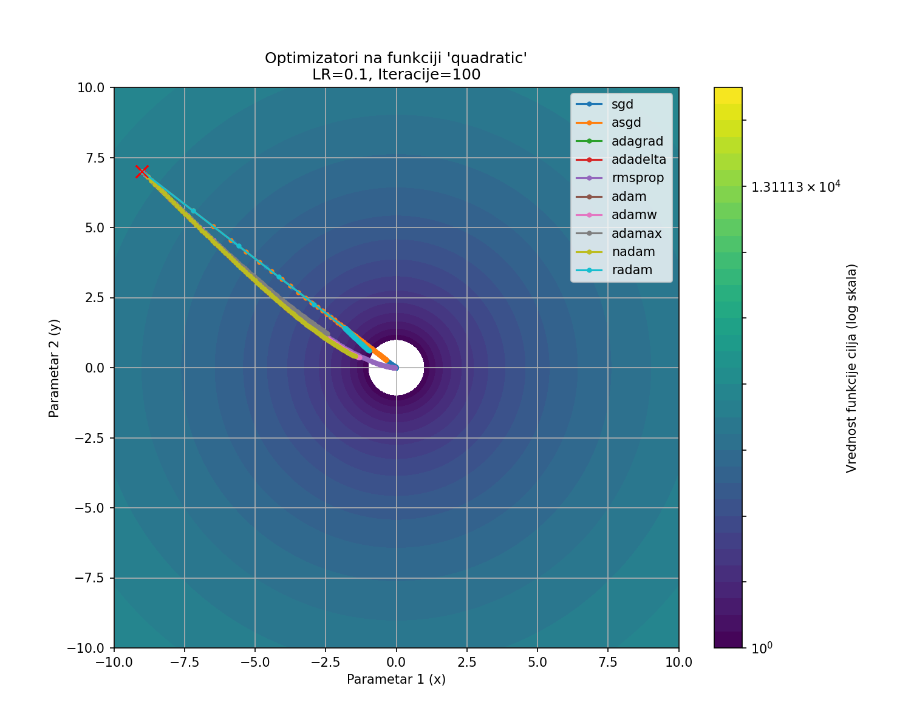
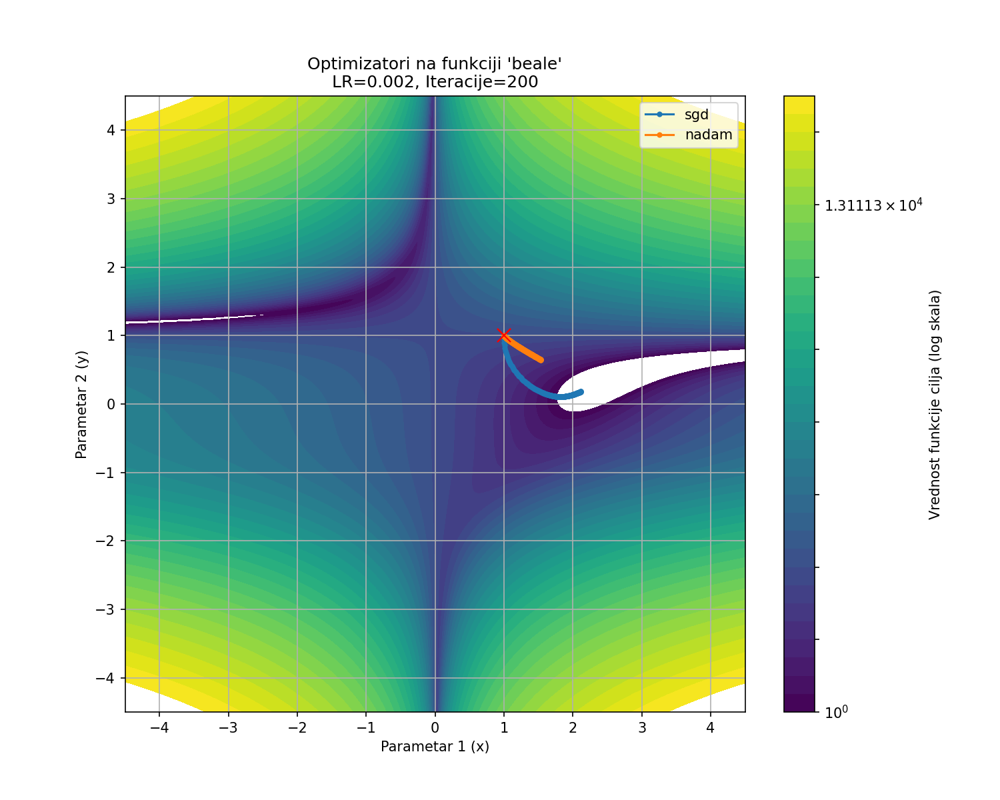

# Vizuelizacija Metoda Optimizacije Dubokih Neuronskih Mreža

Ovaj projekat predstavlja alat napisan u Python-u za vizuelizaciju i analizu ponašanja različitih optimizacionih algoritama koji se koriste u dubokom učenju. Alat generiše statične slike (PNG) i animacije (GIF) koje prikazuju putanje optimizatora na 2D konturnim graficima konveksnih funkcija cilja.

Projekat je realizovan kao deo projektnog zadatka na kursu Izabrana poglavlja iz obrade signala.

## Ključne Mogućnosti

-   **Vizuelizacija putanje optimizacije** za odabranu funkciju cilja.
-   **Uporedni prikaz** više optimizacionih algoritama na istom grafiku.
-   **Generisanje statičnih slika (PNG)** za korišćenje u izveštajima.
-   **Generisanje animacija (GIF)** koje prikazuju kretanje iz iteracije u iteraciju.
-   **Podešavanje parametara:** Mogućnost izbora funkcije, početne tačke, stope učenja, broja iteracija i drugih hiperparametara.
-   **Implementirani optimizatori (10):** SGD, ASGD, Adagrad, Adadelta, RMSprop, Adam, AdamW, Adamax, Nadam i RAdam.

## Primer Rezultata
Sproveo sam kontrolni eksperiment na jednostavnoj kvadratnoj funkciji da bih postavio osnovu za poređenje. Kao što vidimo na slici ispod, svi implementirani optimizatori uspešno konvergiraju ka minimumu, što potvrđuje ispravnost koda.

    ```bash
    python main.py --optimizers sgd asgd adagrad adadelta rmsprop adam adamw adamax nadam radam --function quadratic --initial_point -9 7 --learning_rate 0.1 --iterations 100 --output_file poredjenje_svih_quadratic.png
    ```
    


Ispod je prikaz poređenja putanja SGD i Nadam optimizatora na kompleksnoj `beale` funkciji. Jasno se vidi kako Nadam (narandžasta) pronalazi direktniji put ka minimumu u poređenju sa SGD (plava).




## Instalacija

### Preduslovi
-   Python 3.7+
-   Git
-   (Opciono) **ImageMagick** za generisanje GIF animacija. Može se preuzeti sa [zvanične stranice](https://imagemagick.org/script/download.php). Prilikom instalacije na Windows-u, obavezno štiklirati opciju "Add application directory to your system path (PATH)".

### Koraci
1.  Klonirajte repozitorijum na vaš lokalni računar:
    ```bash
    git clone https://github.com/srdjop/optimization-visualizer.git
    ```

2.  Pozicionirajte se u folder projekta:
    ```bash
    cd optimization-visualizer
    ```

3.  Instalirajte sve potrebne Python biblioteke pomoću priloženog `requirements.txt` fajla:
    ```bash
    pip install -r requirements.txt
    ```

## Korišćenje

Alat se pokreće iz komandne linije (terminala) pomoću `main.py` skripte. Osnovna struktura komande je:

```bash
python main.py --optimizers [OPTIMIZATORI] --function [FUNKCIJA] --initial_point [X Y] [OPCIJE]
```

### Argumenti Komandne Linije
-   `--optimizers`:   Lista imena optimizatora (npr. `sgd adam rmsprop`). Obavezan argument.
-   `--function`:     Ime funkcije cilja (`quadratic`, `booth`, `beale`). Obavezan argument.
-   `--initial_point`: Početna tačka sa X i Y koordinatama (npr. `-8 8`). Obavezan argument.
-   `--learning_rate`: Stopa učenja (npr. `0.01`). Podrazumevana vrednost je `0.01`.
-   `--iterations`:    Broj iteracija (npr. `150`). Podrazumevana vrednost je `100`.
-   `--output_file`:   Putanja do izlaznog fajla. Ekstenzija (`.png`, `.gif`) određuje tip izlaza. Podrazumevana vrednost je `output.png`.
-   `--beta1`, `--beta2`: Hiperparametri za Adam-familiju optimizatora.

### Primeri Komandi

**1. Generisanje uporedne slike za SGD, Adam i RMSprop:**
```bash
python main.py --optimizers sgd adam rmsprop --function booth --initial_point -8 -8 --learning_rate 0.005 --iterations 150 --output_file poredjenje_booth.png
```

**2. Generisanje GIF animacije za Nadam optimizator:**
```bash
python main.py --optimizers nadam --function beale --initial_point 1 1 --learning_rate 0.002 --iterations 200 --output_file animacija_nadam.gif
```

**3. Prikaz divergencije SGD-a sa velikom stopom učenja:**
```bash
python main.py --optimizers sgd --function quadratic --initial_point 5 5 --learning_rate 1.1 --iterations 20 --output_file divergencija_sgd.png
```

## Struktura Koda

-   `main.py`: Glavna skripta koja parsira argumente, pokreće optimizaciju i poziva funkcije za vizuelizaciju.
-   `optimizers.py`: Sadrži klasne implementacije svih 10 optimizacionih algoritama.
-   `functions.py`: Definicije 2D funkcija cilja i njihovih analitičkih gradijenata.
-   `visualization.py`: Modul zadužen za crtanje grafika i kreiranje animacija pomoću biblioteke Matplotlib.
-   `requirements.txt`: Lista Python biblioteka neophodnih za pokretanje projekta.

## Autor

*   **Srđan Protić**
